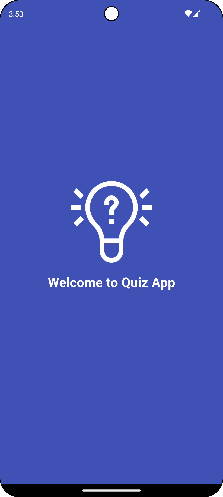
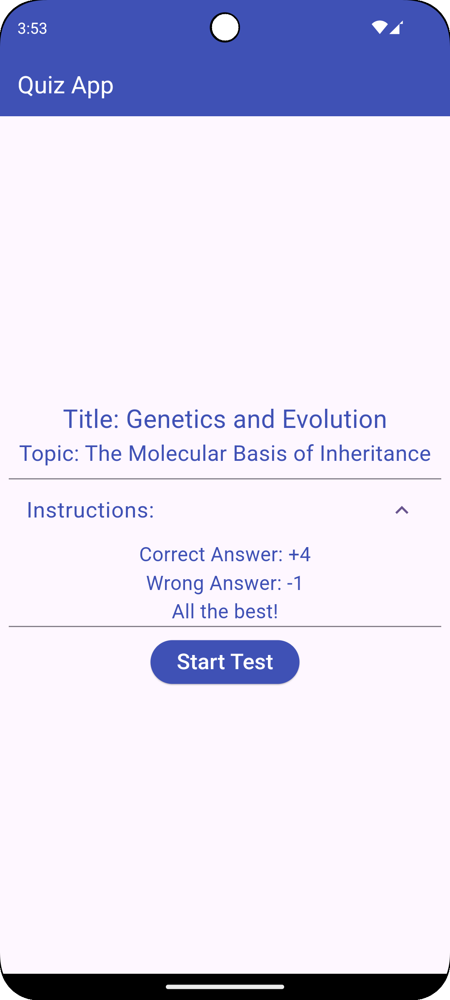
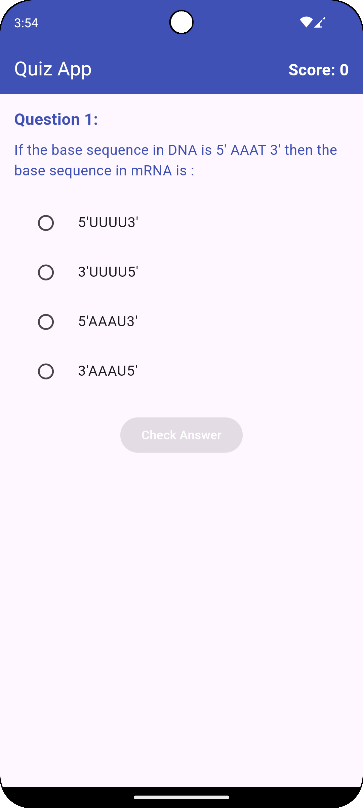
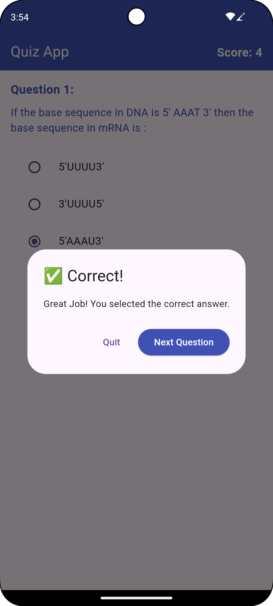
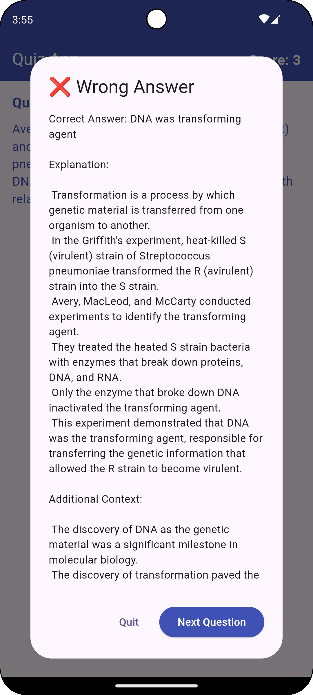
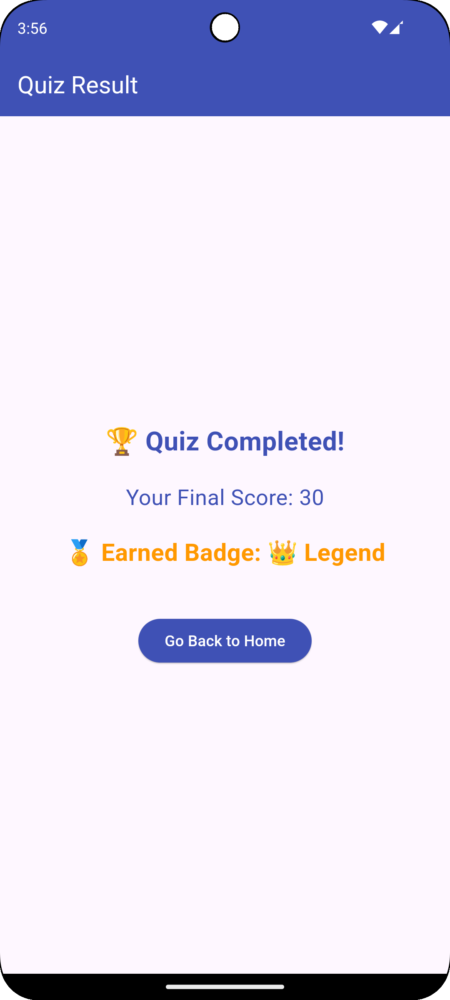

# 📚 Quiz App

A **Flutter-based** quiz application with gamification features, fetching quiz questions from an API. The app awards points based on user responses and grants **game-themed badges** based on final scores.

---

## 🚀 Features

- **📜 Dynamic Quiz Data**: Fetches questions, options, and solutions from an API.
- **🎮 Gamification**:
    - 🏆 **Points System**: +4 for correct answers, -1 for wrong answers.
    - 🎖 **Badges**:
        - 🐣 Rookie (Score ≥ 10)
        - ⚔️ Warrior (Score ≥ 20)
        - 👑 Legend (Score ≥ 30)
- **🔄 Real-time Score Update**: Live score tracking after each question.
- **📊 Result Screen**: Displays the final score and earned badge.
- **🔙 Exit Confirmation**: Prevents accidental quiz exits with a confirmation popup.

---

## 📱 Screenshots

🔹 Splash Screen  


🔹 Home Screen  


🔹 Question Screen  


🔹 Answer Feedback

✅ Correct Answer  


❌ Wrong Answer  


🔹 Result Screen  


---

## 🛠️ Tech Stack

- **Flutter** (Dart)
- **API Integration** (Fetching quiz data dynamically)
- **State Management**: Using `setState`

---

## 📦 Installation

1. **Clone the repository:**
   ```sh
   git clone https://github.com/your-repo/quiz-app.git
   ```
2. **Navigate to the project directory:**
   ```sh
   cd quiz-app
   ```
3. **Install dependencies:**
   ```sh
   flutter pub get
   ```
4. **Run the app:**
   ```sh
   flutter run
   ```

---

## 🎖 Badge System

| Score Range | Badge |
|------------|--------|
| 0 - 9 | No Badge Earned |
| 10 - 19 | 🐣 Rookie |
| 20 - 29 | ⚔️ Warrior |
| 30+ | 👑 Legend |

---
📌 How to Play?

1. Start the quiz from the Home Screen.
2. Select an answer for each question.
3. Submit your answer and get instant feedback.
4. Your score updates dynamically after each question.
5. Complete the quiz and see your final score and badge.

---
## 🎯 Future Enhancements

- 🌟 **Leaderboard**: Track top scores globally.
- 🔄 **Offline Mode**: Save progress without an internet connection.
- 🎇 **Animations**: Reward users with visual effects for correct answers and badges.
- 📜 **Achievements Screen**: View earned badges and progress.

---

## 🤝 Contributing

1. Fork the repository.
2. Create a new branch (`feature-name`).
3. Commit your changes (`git commit -m 'Added feature X'`).
4. Push to the branch (`git push origin feature-name`).
5. Open a pull request.

---

💡 *"Keep Learning, Keep Quizzing!"* 🎯

